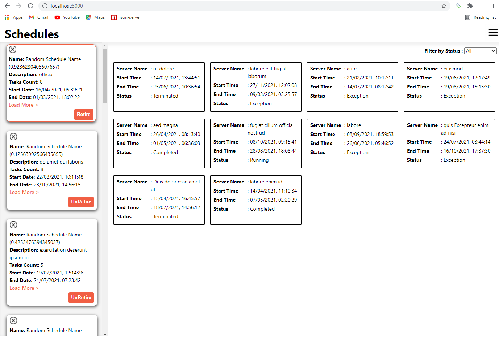

# Blue Prism UI Tech Test

## Changes to mock API

I have changed the mock API to host in the port 3004.Please do add the below changes to the package.json file in the mock API server project
```sh
"scripts": {
    "prestart": "node scripts/generateMockData",
    "start": "json-server --watch src/api/db.json --port 3004"
 }
```
All the API calls used in my project will have reference to port 3004 which can be changed in App.js file

```sh
const URLS = {
    scheduleBaseUrl:"http://localhost:3004/schedules",
    scheduleLogBaseUrl:"http://localhost:3004/scheduleLogs"
}
```

## Application details

I have developed the app in React and have used Create React App to bootstrap the build. It is hosted in port 3000. For API calls, I have used 'axios'.

## Componenet/Data display

- Date is converted to readable format (local GB date string) in the schedule cards and log table.
- Added Load more/Show less link in schedule card to display more cards.
- Added a filter in the logs table to filter the entries by 'Status'
- As an improvement The logs of the first schedule will be displayed on first load
- The page is responsive and can be used in mobile devices as well.

## All use cases are covered
- As a user I initially get presented with a list of the available schedules.
- As a user I can view a schedule corresponding log entries by selecting its card.
- As a user I can switch a schedule to retired/unretired.





